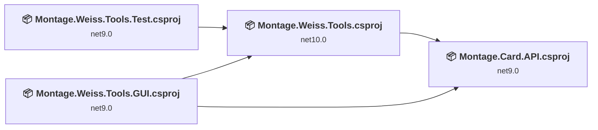
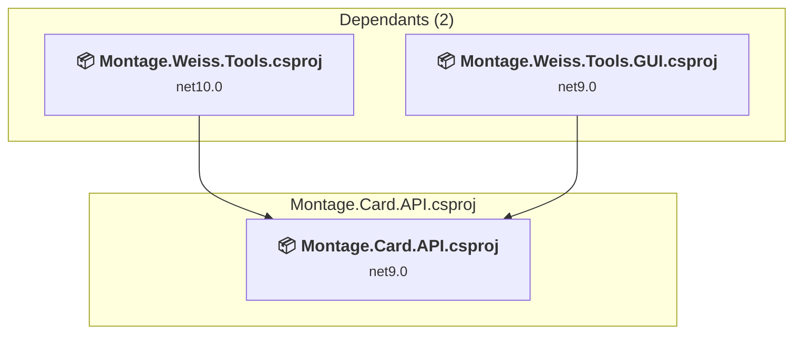
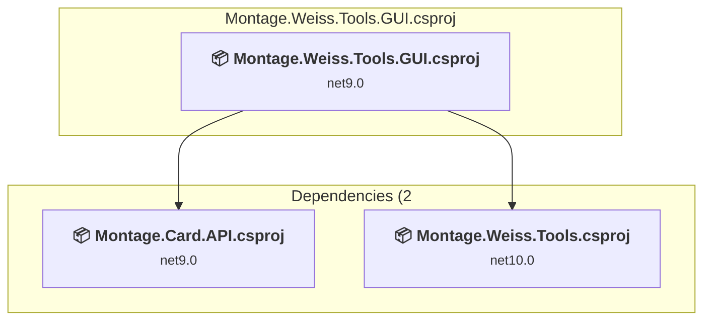
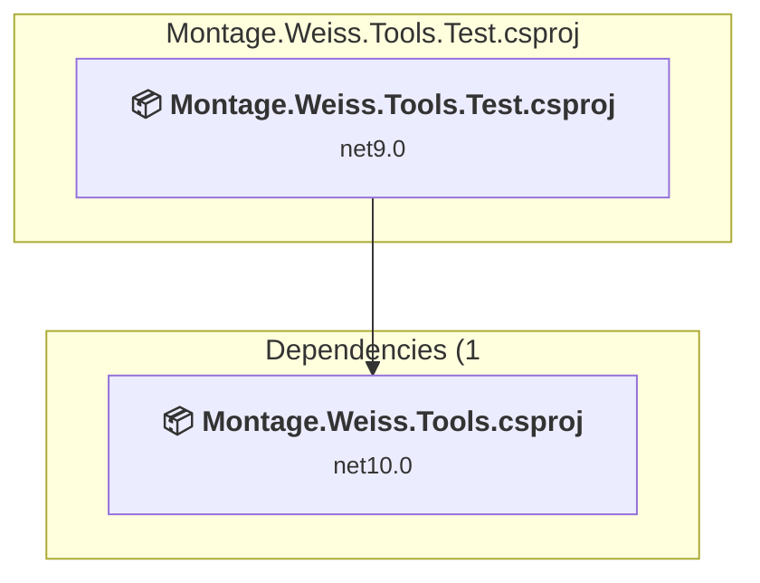
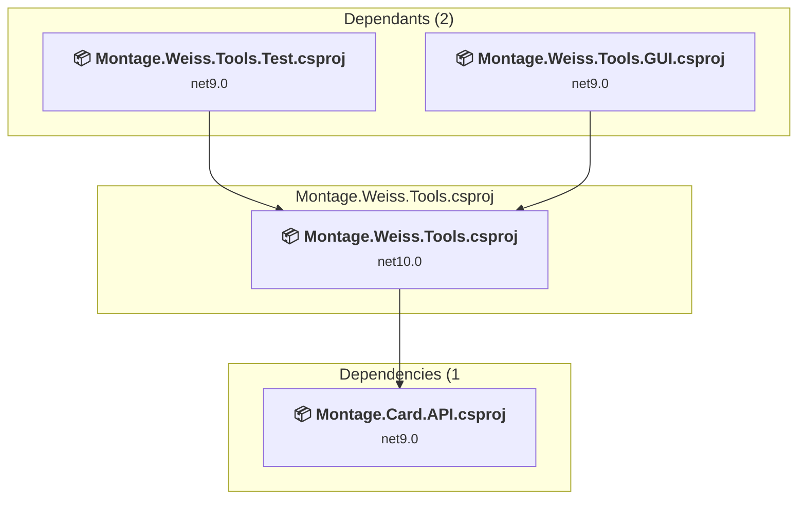

# Projects and dependencies analysis

This document provides a comprehensive overview of the projects and their dependencies in the context of upgrading to .NETCoreApp,Version=v10.0.

## Table of Contents

- [Executive Summary](#executive-Summary)
  - [Highlevel Metrics](#highlevel-metrics)
  - [Projects Compatibility](#projects-compatibility)
  - [Package Compatibility](#package-compatibility)
  - [API Compatibility](#api-compatibility)
- [Aggregate NuGet packages details](#aggregate-nuget-packages-details)
- [Top API Migration Challenges](#top-api-migration-challenges)
  - [Technologies and Features](#technologies-and-features)
  - [Most Frequent API Issues](#most-frequent-api-issues)
- [Projects Relationship Graph](#projects-relationship-graph)
- [Project Details](#project-details)

  - [Montage.Card.API\Montage.Card.API.csproj](#montagecardapimontagecardapicsproj)
  - [Montage.Weiss.Tools.GUI\Montage.Weiss.Tools.GUI.csproj](#montageweisstoolsguimontageweisstoolsguicsproj)
  - [Montage.Weiss.Tools.Test\Montage.Weiss.Tools.Test.csproj](#montageweisstoolstestmontageweisstoolstestcsproj)
  - [MontageWeissTools\Montage.Weiss.Tools.csproj](#montageweisstoolsmontageweisstoolscsproj)

## Executive Summary

### Highlevel Metrics

| Metric | Count | Status |
| :--- | :---: | :--- |
| Total Projects | 4 | 3 require upgrade |
| Total NuGet Packages | 43 | 6 need upgrade |
| Total Code Files | 201 |  |
| Total Code Files with Incidents | 13 |  |
| Total Lines of Code | 18110 |  |
| Total Number of Issues | 67 |  |
| Estimated LOC to modify | 57+ | at least 0.3% of codebase |

### Projects Compatibility

| Project | Target Framework | Difficulty | Package Issues | API Issues | Est. LOC Impact | Description |
| :--- | :---: | :---: | :---: | :---: | :---: | :--- |
| [Montage.Card.API\Montage.Card.API.csproj](#montagecardapimontagecardapicsproj) | net9.0 | 🟢 Low | 5 | 3 | 3+ | ClassLibrary, Sdk Style = True |
| [Montage.Weiss.Tools.GUI\Montage.Weiss.Tools.GUI.csproj](#montageweisstoolsguimontageweisstoolsguicsproj) | net9.0 | 🟢 Low | 1 | 44 | 44+ | WinForms, Sdk Style = True |
| [Montage.Weiss.Tools.Test\Montage.Weiss.Tools.Test.csproj](#montageweisstoolstestmontageweisstoolstestcsproj) | net9.0 | 🟢 Low | 1 | 10 | 10+ | DotNetCoreApp, Sdk Style = True |
| [MontageWeissTools\Montage.Weiss.Tools.csproj](#montageweisstoolsmontageweisstoolscsproj) | net10.0 | ✅ None | 0 | 0 |  | DotNetCoreApp, Sdk Style = True |

### Package Compatibility

| Status | Count | Percentage |
| :--- | :---: | :---: |
| ✅ Compatible | 37 | 86.0% |
| ⚠️ Incompatible | 1 | 2.3% |
| 🔄 Upgrade Recommended | 5 | 11.6% |
| ***Total NuGet Packages*** | ***43*** | ***100%*** |

### API Compatibility

| Category | Count | Impact |
| :--- | :---: | :--- |
| 🔴 Binary Incompatible | 1 | High - Require code changes |
| 🟡 Source Incompatible | 2 | Medium - Needs re-compilation and potential conflicting API error fixing |
| 🔵 Behavioral change | 54 | Low - Behavioral changes that may require testing at runtime |
| ✅ Compatible | 10953 |  |
| ***Total APIs Analyzed*** | ***11010*** |  |

## Aggregate NuGet packages details

| Package | Current Version | Suggested Version | Projects | Description |
| :--- | :---: | :---: | :--- | :--- |
| AngleSharp | 1.3.0 |  | [Montage.Card.API.csproj](#montagecardapimontagecardapicsproj) [Montage.Weiss.Tools.csproj](#montageweisstoolsmontageweisstoolscsproj) | ✅Compatible |
| Avalonia | 11.3.6 |  | [Montage.Card.API.csproj](#montagecardapimontagecardapicsproj) [Montage.Weiss.Tools.csproj](#montageweisstoolsmontageweisstoolscsproj) [Montage.Weiss.Tools.GUI.csproj](#montageweisstoolsguimontageweisstoolsguicsproj) | ✅Compatible |
| Avalonia.Desktop | 11.3.6 |  | [Montage.Card.API.csproj](#montagecardapimontagecardapicsproj) [Montage.Weiss.Tools.csproj](#montageweisstoolsmontageweisstoolscsproj) [Montage.Weiss.Tools.GUI.csproj](#montageweisstoolsguimontageweisstoolsguicsproj) | ✅Compatible |
| Avalonia.Diagnostics | 11.3.6 |  | [Montage.Weiss.Tools.GUI.csproj](#montageweisstoolsguimontageweisstoolsguicsproj) | ✅Compatible |
| Avalonia.Fonts.Inter | 11.3.6 |  | [Montage.Weiss.Tools.GUI.csproj](#montageweisstoolsguimontageweisstoolsguicsproj) | ✅Compatible |
| Avalonia.ReactiveUI | 11.3.6 |  | [Montage.Weiss.Tools.GUI.csproj](#montageweisstoolsguimontageweisstoolsguicsproj) | ⚠️NuGet package is deprecated |
| Avalonia.Themes.Fluent | 11.3.6 |  | [Montage.Weiss.Tools.GUI.csproj](#montageweisstoolsguimontageweisstoolsguicsproj) | ✅Compatible |
| CommandLineParser | 2.9.1 |  | [Montage.Weiss.Tools.csproj](#montageweisstoolsmontageweisstoolscsproj) | ✅Compatible |
| CommunityToolkit.Mvvm | 8.4.0 |  | [Montage.Weiss.Tools.GUI.csproj](#montageweisstoolsguimontageweisstoolsguicsproj) | ✅Compatible |
| coverlet.collector | 6.0.4 |  | [Montage.Weiss.Tools.Test.csproj](#montageweisstoolstestmontageweisstoolstestcsproj) | ✅Compatible |
| FluentPath | 2.0.0 |  | [Montage.Weiss.Tools.csproj](#montageweisstoolsmontageweisstoolscsproj) | ✅Compatible |
| Flurl.Http | 4.0.2 |  | [Montage.Weiss.Tools.csproj](#montageweisstoolsmontageweisstoolscsproj) | ✅Compatible |
| Lamar | 15.0.1 |  | [Montage.Weiss.Tools.csproj](#montageweisstoolsmontageweisstoolscsproj) [Montage.Weiss.Tools.Test.csproj](#montageweisstoolstestmontageweisstoolstestcsproj) | ✅Compatible |
| LinqKit | 1.3.8 |  | [Montage.Weiss.Tools.csproj](#montageweisstoolsmontageweisstoolscsproj) | ✅Compatible |
| Microsoft.EntityFrameworkCore | 9.0.9 | 10.0.5 | [Montage.Card.API.csproj](#montagecardapimontagecardapicsproj) | NuGet package upgrade is recommended |
| Microsoft.EntityFrameworkCore.Relational | 9.0.9 | 10.0.5 | [Montage.Card.API.csproj](#montagecardapimontagecardapicsproj) | NuGet package upgrade is recommended |
| Microsoft.EntityFrameworkCore.Sqlite | 9.0.9 |  | [Montage.Weiss.Tools.csproj](#montageweisstoolsmontageweisstoolscsproj) | ✅Compatible |
| Microsoft.EntityFrameworkCore.Tools | 9.0.9 |  | [Montage.Weiss.Tools.csproj](#montageweisstoolsmontageweisstoolscsproj) | ✅Compatible |
| Microsoft.Extensions.Caching.Memory | 9.0.9 | 10.0.5 | [Montage.Card.API.csproj](#montagecardapimontagecardapicsproj) [Montage.Weiss.Tools.csproj](#montageweisstoolsmontageweisstoolscsproj) | NuGet package upgrade is recommended |
| Microsoft.Extensions.DependencyInjection.Abstractions | 9.0.9 | 10.0.5 | [Montage.Weiss.Tools.Test.csproj](#montageweisstoolstestmontageweisstoolstestcsproj) | NuGet package upgrade is recommended |
| Microsoft.NET.Test.Sdk | 17.14.1 |  | [Montage.Weiss.Tools.Test.csproj](#montageweisstoolstestmontageweisstoolstestcsproj) | ✅Compatible |
| Microsoft.Win32.Registry | 5.0.0 |  | [Montage.Card.API.csproj](#montagecardapimontagecardapicsproj) [Montage.Weiss.Tools.csproj](#montageweisstoolsmontageweisstoolscsproj) | NuGet package functionality is included with framework reference |
| MSTest.TestAdapter | 3.10.4 |  | [Montage.Weiss.Tools.Test.csproj](#montageweisstoolstestmontageweisstoolstestcsproj) | ✅Compatible |
| MSTest.TestFramework | 3.10.4 |  | [Montage.Weiss.Tools.Test.csproj](#montageweisstoolstestmontageweisstoolstestcsproj) | ✅Compatible |
| Octokit | 14.0.0 |  | [Montage.Weiss.Tools.csproj](#montageweisstoolsmontageweisstoolscsproj) | ✅Compatible |
| OfficeIMO.Word | 1.0.8 |  | [Montage.Weiss.Tools.csproj](#montageweisstoolsmontageweisstoolscsproj) | ✅Compatible |
| Polly | 8.6.3 |  | [Montage.Weiss.Tools.csproj](#montageweisstoolsmontageweisstoolscsproj) | ✅Compatible |
| ReactiveUI | 20.4.1 |  | [Montage.Weiss.Tools.GUI.csproj](#montageweisstoolsguimontageweisstoolsguicsproj) | ✅Compatible |
| Serilog | 4.3.0 |  | [Montage.Card.API.csproj](#montagecardapimontagecardapicsproj) [Montage.Weiss.Tools.csproj](#montageweisstoolsmontageweisstoolscsproj) | ✅Compatible |
| Serilog.Extensions.Logging | 9.0.2 |  | [Montage.Weiss.Tools.csproj](#montageweisstoolsmontageweisstoolscsproj) | ✅Compatible |
| Serilog.Sinks.Console | 6.0.0 |  | [Montage.Weiss.Tools.csproj](#montageweisstoolsmontageweisstoolscsproj) | ✅Compatible |
| Serilog.Sinks.Debug | 3.0.0 |  | [Montage.Weiss.Tools.csproj](#montageweisstoolsmontageweisstoolscsproj) | ✅Compatible |
| Serilog.Sinks.File | 7.0.0 |  | [Montage.Weiss.Tools.csproj](#montageweisstoolsmontageweisstoolscsproj) | ✅Compatible |
| Serilog.Sinks.Trace | 4.0.0 |  | [Montage.Weiss.Tools.csproj](#montageweisstoolsmontageweisstoolscsproj) | ✅Compatible |
| SixLabors.ImageSharp | 2.1.11 |  | [Montage.Card.API.csproj](#montagecardapimontagecardapicsproj) [Montage.Weiss.Tools.csproj](#montageweisstoolsmontageweisstoolscsproj) [Montage.Weiss.Tools.GUI.csproj](#montageweisstoolsguimontageweisstoolsguicsproj) [Montage.Weiss.Tools.Test.csproj](#montageweisstoolstestmontageweisstoolstestcsproj) | ✅Compatible |
| Splat.Serilog | 15.3.1 |  | [Montage.Weiss.Tools.GUI.csproj](#montageweisstoolsguimontageweisstoolsguicsproj) | ✅Compatible |
| System.Interactive.Async | 6.0.3 |  | [Montage.Weiss.Tools.csproj](#montageweisstoolsmontageweisstoolscsproj) | ✅Compatible |
| System.Linq.Async | 6.0.3 |  | [Montage.Card.API.csproj](#montagecardapimontagecardapicsproj) [Montage.Weiss.Tools.csproj](#montageweisstoolsmontageweisstoolscsproj) | ✅Compatible |
| System.Net.Http.Json | 9.0.9 |  | [Montage.Weiss.Tools.csproj](#montageweisstoolsmontageweisstoolscsproj) | ✅Compatible |
| System.Text.Json | 9.0.9 | 10.0.5 | [Montage.Card.API.csproj](#montagecardapimontagecardapicsproj) [Montage.Weiss.Tools.csproj](#montageweisstoolsmontageweisstoolscsproj) | NuGet package upgrade is recommended |
| Xaml.Behaviors.Avalonia | 11.3.2 |  | [Montage.Weiss.Tools.GUI.csproj](#montageweisstoolsguimontageweisstoolsguicsproj) | ✅Compatible |
| Xaml.Behaviors.Interactivity | 11.3.2 |  | [Montage.Weiss.Tools.GUI.csproj](#montageweisstoolsguimontageweisstoolsguicsproj) | ✅Compatible |
| YamlDotNet | 16.3.0 |  | [Montage.Weiss.Tools.csproj](#montageweisstoolsmontageweisstoolscsproj) | ✅Compatible |

## Top API Migration Challenges

### Technologies and Features

| Technology | Issues | Percentage | Migration Path |
| :--- | :---: | :---: | :--- |

### Most Frequent API Issues

| API | Count | Percentage | Category |
| :--- | :---: | :---: | :--- |
| T:System.Uri | 29 | 50.9% | Behavioral Change |
| M:System.Uri.#ctor(System.String) | 20 | 35.1% | Behavioral Change |
| T:System.Net.Http.HttpContent | 2 | 3.5% | Behavioral Change |
| M:System.String.Join(System.String,System.ReadOnlySpan{System.String}) | 2 | 3.5% | Source Incompatible |
| M:System.ValueType.Equals(System.Object) | 1 | 1.8% | Behavioral Change |
| P:System.Environment.OSVersion | 1 | 1.8% | Behavioral Change |
| T:System.Linq.AsyncEnumerable | 1 | 1.8% | Binary Incompatible |
| P:System.Uri.AbsolutePath | 1 | 1.8% | Behavioral Change |

## Projects Relationship Graph

Legend:
📦 SDK-style project
⚙️ Classic project

## Project Details

### Montage.Card.API\Montage.Card.API.csproj

#### Project Info

- **Current Target Framework:** net9.0
- **Proposed Target Framework:** net10.0
- **SDK-style**: True
- **Project Kind:** ClassLibrary
- **Dependencies**: 0
- **Dependants**: 2
- **Number of Files**: 44
- **Number of Files with Incidents**: 4
- **Lines of Code**: 1404
- **Estimated LOC to modify**: 3+ (at least 0.2% of the project)

#### Dependency Graph

Legend:
📦 SDK-style project
⚙️ Classic project

### API Compatibility

| Category | Count | Impact |
| :--- | :---: | :--- |
| 🔴 Binary Incompatible | 1 | High - Require code changes |
| 🟡 Source Incompatible | 0 | Medium - Needs re-compilation and potential conflicting API error fixing |
| 🔵 Behavioral change | 2 | Low - Behavioral changes that may require testing at runtime |
| ✅ Compatible | 1022 |  |
| ***Total APIs Analyzed*** | ***1025*** |  |

### Montage.Weiss.Tools.GUI\Montage.Weiss.Tools.GUI.csproj

#### Project Info

- **Current Target Framework:** net9.0
- **Proposed Target Framework:** net10.0-windows
- **SDK-style**: True
- **Project Kind:** WinForms
- **Dependencies**: 2
- **Dependants**: 0
- **Number of Files**: 37
- **Number of Files with Incidents**: 6
- **Lines of Code**: 2782
- **Estimated LOC to modify**: 44+ (at least 1.6% of the project)

#### Dependency Graph

Legend:
📦 SDK-style project
⚙️ Classic project

### API Compatibility

| Category | Count | Impact |
| :--- | :---: | :--- |
| 🔴 Binary Incompatible | 0 | High - Require code changes |
| 🟡 Source Incompatible | 2 | Medium - Needs re-compilation and potential conflicting API error fixing |
| 🔵 Behavioral change | 42 | Low - Behavioral changes that may require testing at runtime |
| ✅ Compatible | 9168 |  |
| ***Total APIs Analyzed*** | ***9212*** |  |

### Montage.Weiss.Tools.Test\Montage.Weiss.Tools.Test.csproj

#### Project Info

- **Current Target Framework:** net9.0
- **Proposed Target Framework:** net10.0
- **SDK-style**: True
- **Project Kind:** DotNetCoreApp
- **Dependencies**: 1
- **Dependants**: 0
- **Number of Files**: 15
- **Number of Files with Incidents**: 3
- **Lines of Code**: 945
- **Estimated LOC to modify**: 10+ (at least 1.1% of the project)

#### Dependency Graph

Legend:
📦 SDK-style project
⚙️ Classic project

### API Compatibility

| Category | Count | Impact |
| :--- | :---: | :--- |
| 🔴 Binary Incompatible | 0 | High - Require code changes |
| 🟡 Source Incompatible | 0 | Medium - Needs re-compilation and potential conflicting API error fixing |
| 🔵 Behavioral change | 10 | Low - Behavioral changes that may require testing at runtime |
| ✅ Compatible | 763 |  |
| ***Total APIs Analyzed*** | ***773*** |  |

### MontageWeissTools\Montage.Weiss.Tools.csproj

#### Project Info

- **Current Target Framework:** net10.0✅
- **SDK-style**: True
- **Project Kind:** DotNetCoreApp
- **Dependencies**: 1
- **Dependants**: 2
- **Number of Files**: 110
- **Lines of Code**: 12979
- **Estimated LOC to modify**: 0+ (at least 0.0% of the project)

#### Dependency Graph

Legend:
📦 SDK-style project
⚙️ Classic project

### API Compatibility

| Category | Count | Impact |
| :--- | :---: | :--- |
| 🔴 Binary Incompatible | 0 | High - Require code changes |
| 🟡 Source Incompatible | 0 | Medium - Needs re-compilation and potential conflicting API error fixing |
| 🔵 Behavioral change | 0 | Low - Behavioral changes that may require testing at runtime |
| ✅ Compatible | 0 |  |
| ***Total APIs Analyzed*** | ***0*** |  |

